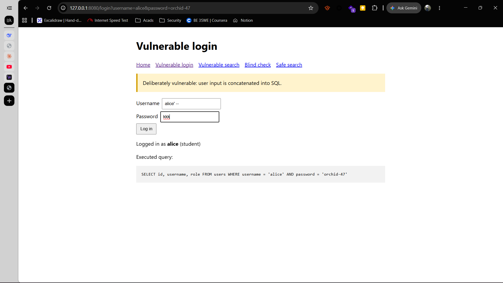
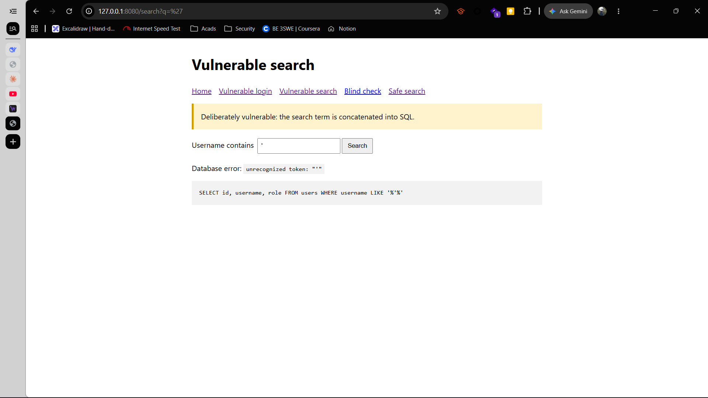
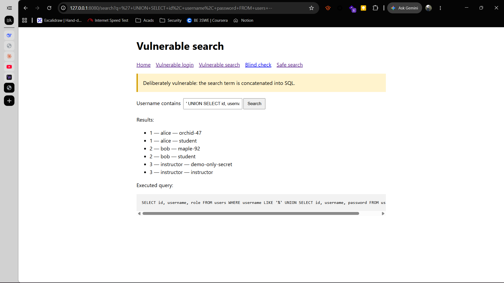
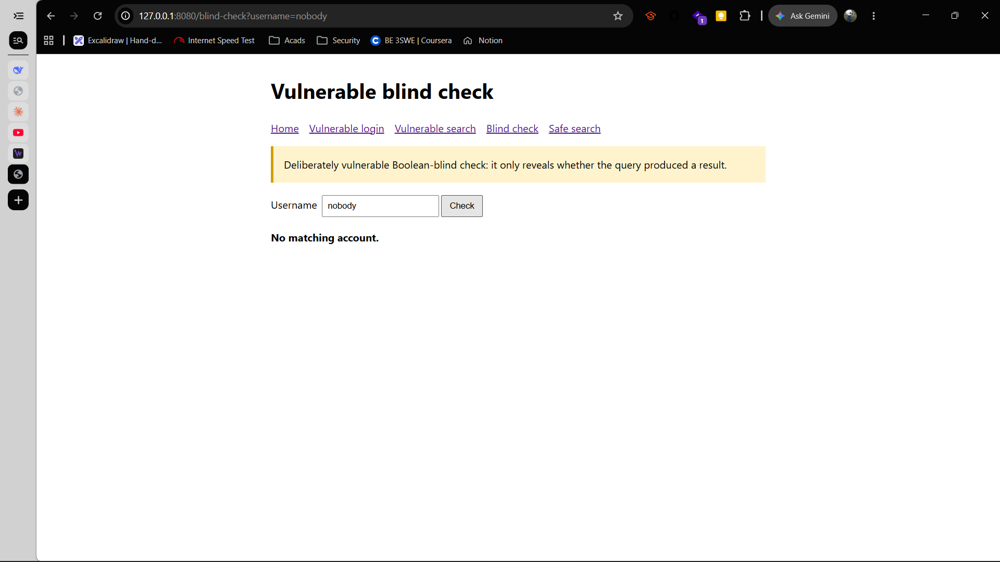
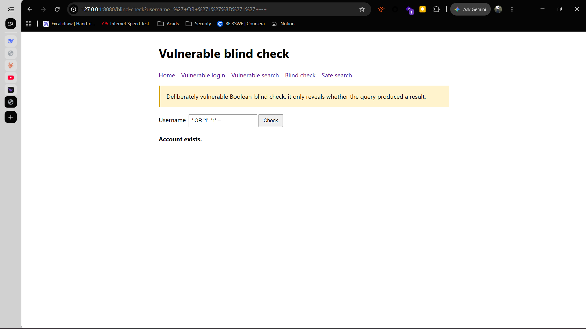

# Practical Report: SQL Injection Vulnerability Assessment

**Module:** WEB404 Secure Coding Practices
**Practical:** 5 — Vulnerable web application and SQL injection
**Student:** Sonam Tenzin
**Date:** 2026-08-25

## Vulnerability Summary

| ID | Vulnerability | CWE | OWASP Category | Severity |
| --- | --- | --- | --- | --- |
| V1 | Authentication bypass via comment injection | CWE-89 | A03:2021 — Injection | Critical |
| V2 | Error-based SQL injection (verbose DB errors) | CWE-89 | A03:2021 — Injection | Medium |
| V3 | UNION-based data extraction | CWE-89 | A03:2021 — Injection | Critical |
| V4 | Boolean-blind SQL injection | CWE-89 | A03:2021 — Injection | High |

## 1. Objective

The purpose of this practical was to set up a deliberately vulnerable web application, identify SQL injection weaknesses, demonstrate their impact in an authorised local environment, and compare the vulnerable implementation with a secure implementation using parameterized SQL queries.

## 2. Ethical scope

All testing was carried out against a self-created application on `127.0.0.1` (localhost). The application uses fictional accounts and a disposable SQLite database. No external system, real account, or network service was tested. SQL injection testing must only be performed with explicit authorisation.

## 3. Testing methodology

This assessment followed a structured black-box methodology consistent with standard injection-testing practice:

1. **Baseline verification** — confirm the login and search features behave correctly with valid input before attempting any injection (Test 1).
2. **Input probing** — submit a single quotation mark to detect whether unsanitised input reaches the SQL layer, evidenced by a database syntax error (Test 3).
3. **Exploitation** — construct comment-based, UNION-based, and boolean-based payloads to demonstrate concrete impact: authentication bypass, data extraction, and true/false inference (Tests 2, 4, 5).
4. **Control verification** — repeat the identical payloads against the parameterized `/safe-search` endpoint to confirm the fix holds under the same conditions that broke the vulnerable page.
5. **Reporting** — document each payload, the resulting query, and the observed impact, classified against CWE-89 above.

## 4. Environment and setup

| Component | Details |
| --- | --- |
| Operating system | Windows |
| Language | Python 3.14 |
| Web server | Python `ThreadingHTTPServer` |
| Database | SQLite |
| Application address | `http://127.0.0.1:8080` |
| Application file | `app.py` |

The lab was started with the following command:

```powershell
python app.py
```

The server was intentionally restricted to localhost. On every launch, it recreated `training_lab.db` containing three fictional users: `alice`, `bob`, and `instructor`.

## 5. Vulnerability description

SQL injection occurs when an application combines untrusted user input directly into an SQL statement. The vulnerable login page used string formatting in the following pattern:

```sql
SELECT id, username, role FROM users
WHERE username = '<username input>' AND password = '<password input>'
```

Because the input was inserted directly into the query, quotation marks, SQL operators, and comments supplied by a user could alter the intended query logic.

## 6. Test results

### Test 1: Normal authentication baseline

| Item | Observation |
| --- | --- |
| Page | Vulnerable login |
| Input | Username: `alice`; Password: `orchid-47` |
| Result | Login succeeded as `alice` with the `student` role. |
| Purpose | Confirmed that the application and database were functioning before injection testing. |


### Test 2: Authentication bypass using SQL comments

| Item | Observation |
| --- | --- |
| Page | Vulnerable login |
| Input | Username: `alice' -- `; Password: any value |
| Result | The application logged in as `alice` without validating the supplied password. |
| Vulnerability type | Tautology/comment-based authentication bypass |

The resulting SQL was equivalent to:

```sql
SELECT id, username, role FROM users
WHERE username = 'alice' -- ' AND password = 'any value'
```

The SQL comment marker caused the password condition to be ignored. This demonstrates that direct query construction can allow an attacker to bypass authentication.




### Test 3: Error-based SQL injection discovery

| Item | Observation |
| --- | --- |
| Page | Vulnerable search |
| Input | A single quotation mark: `'` |
| Result | SQLite returned a syntax error. |
| Vulnerability type | Error-based SQL injection |

The error occurred because the quotation mark terminated the string value used by the query. Detailed database errors help attackers understand the database syntax and should not be shown to end users in a production application.



### Test 4: UNION-based data extraction

| Item | Observation |
| --- | --- |
| Page | Vulnerable search |
| Input | `' UNION SELECT id, username, password FROM users -- ` |
| Result | The search page displayed records from the `users` table, including the demonstration password values. |
| Vulnerability type | UNION-based SQL injection |

The original search query selected three columns. The injected `UNION SELECT` also returned three compatible columns, allowing data from the database to be combined with the normal search results. The third selected field (`password`) appeared in the page column normally used for roles.



### Test 5: Boolean-blind SQL injection

| Item | Observation |
| --- | --- |
| Page | Blind check |
| Baseline input | A nonexistent username, for example `nobody` |
| Baseline result | `No matching account.` |
| Injection input | `' OR '1'='1' -- ` |
| Injection result | `Account exists.` |
| Vulnerability type | Boolean-blind SQL injection |

Unlike the search page, this endpoint does not show records, query text, or database errors. It only returns one of two messages. The injection input makes the query condition true and changes the response from “No matching account” to “Account exists.” This demonstrates how an attacker can infer information one true/false condition at a time even when a web application hides detailed errors and results.





## 7. Security impact

The findings show that SQL injection can have serious consequences:

- Authentication may be bypassed, allowing unauthorised access to user accounts.
- Sensitive records can be read from database tables.
- Error messages can reveal useful information about the database structure.
- In a real system with excessive database privileges, an injection flaw could potentially allow modification or deletion of data.

Although this lab uses fictional data, storing or exposing plain-text passwords would be especially harmful in a real application.

## 8. Mitigation and verification

The application included a **Safe search** page as a comparison. It used a parameterized query instead of placing the supplied value inside SQL text:

```python
query = "SELECT id, username, role FROM users WHERE username LIKE ?"
rows = connection.execute(query, (f"%{term}%",)).fetchall()
```

When the quote and UNION inputs from Tests 3 and 4 were submitted to this page, they were treated as ordinary search terms. No SQL error occurred and no additional records were returned. This verifies that parameterized queries prevent the input from changing the SQL statement’s structure.

**Replication steps**

1. Open `http://127.0.0.1:8080/safe-search`.
2. Submit the single quote and UNION inputs used in Tests 3 and 4, one at a time.
3. Verify that neither input produces a database error or extracts records.
4. Record the query and parameters shown by the page.

Recommended defenses are:

- Use parameterized queries (prepared statements) for every database operation.
- Never construct SQL by concatenating or formatting user input.
- Hash passwords with a dedicated password-hashing algorithm such as Argon2 or bcrypt; never store plain-text passwords.
- Display generic error messages to users and store technical error details only in protected server logs.
- Use a database account with only the permissions required by the application.
- Validate input as an additional control, while recognising that validation does not replace parameterized queries.

## 9. Module concepts applied

| Module topic | How it was applied |
| --- | --- |
| 2.1.1 Types of SQL injection | Demonstrated error-based (Test 3) and UNION-based (Test 4) variants |
| 2.1.2 Blind SQL injection | Demonstrated in Test 5 via true/false inference on the blind-check endpoint |
| 2.1.3 / 2.7.2 SQL injection prevention / Parameterized queries | Demonstrated by the `/safe-search` comparison in Section 8 |
| 2.6.1 Authentication bypass techniques | Demonstrated in Test 2 via comment-based tautology bypass |
| 2.4.2 Error message handling | Discussed in Section 7 regarding verbose database errors leaking schema information |
| 2.7.1 Input validation and sanitization | Discussed in Section 8 as defense-in-depth alongside parameterization |

## 10. Conclusion

The practical successfully demonstrated four SQL injection outcomes in a controlled local environment: authentication bypass, error-based discovery, UNION-based data extraction, and Boolean-blind inference. The vulnerable pages failed because they inserted user input directly into SQL statements. The parameterized implementation prevented the same payloads from changing the query logic. Therefore, prepared statements and secure password handling are essential controls for web applications that use databases.

## References

- Stuttard, D., & Pinto, M. (2011). *The Web Application Hacker's Handbook: Finding and Exploiting Security Flaws* (Ch. 9, Attacking Data Stores). John Wiley & Sons.
- OWASP Foundation. *SQL Injection Prevention Cheat Sheet*. owasp.org.
- MITRE. *CWE-89: Improper Neutralization of Special Elements used in an SQL Command ('SQL Injection')*. cwe.mitre.org.

## Appendix: Running and cleanup

Start the lab with `python app.py`, then browse to `http://127.0.0.1:8080`. Stop the server with `Ctrl+C`. The generated `training_lab.db` is disposable and is recreated whenever the application starts.
