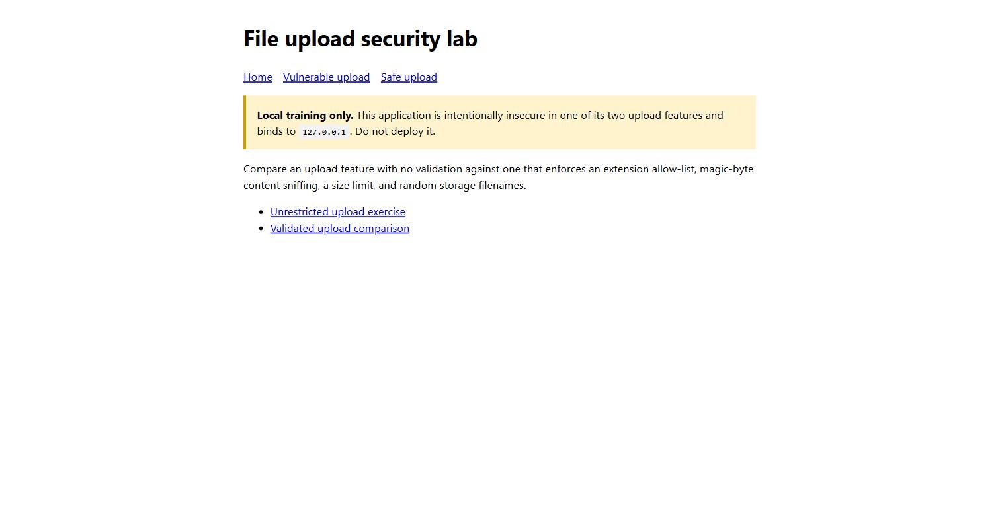
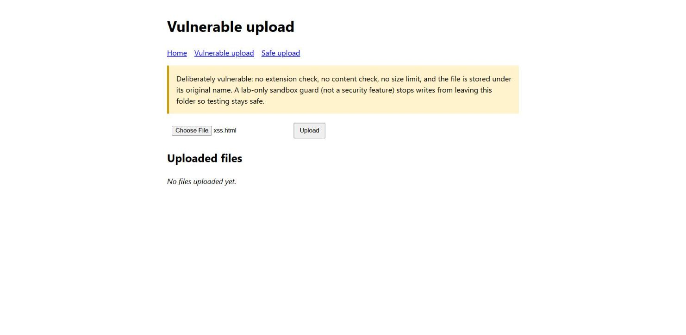
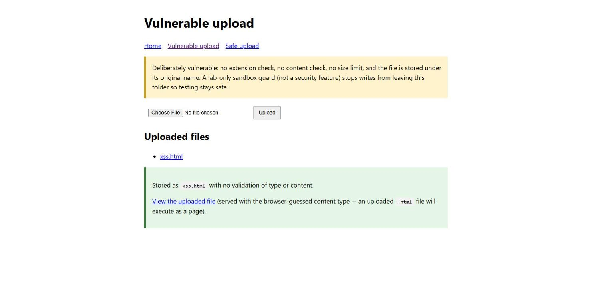
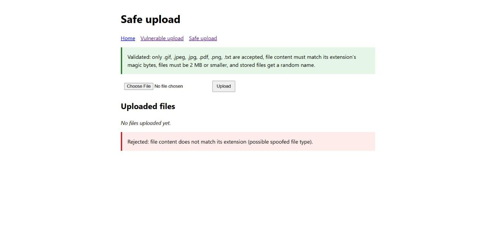
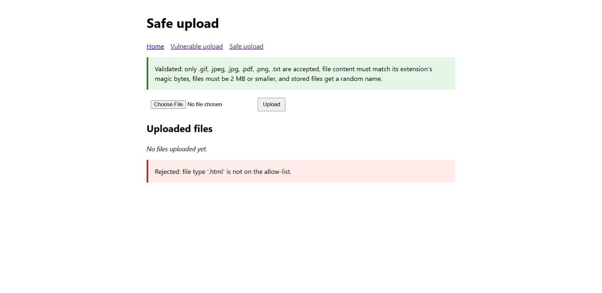
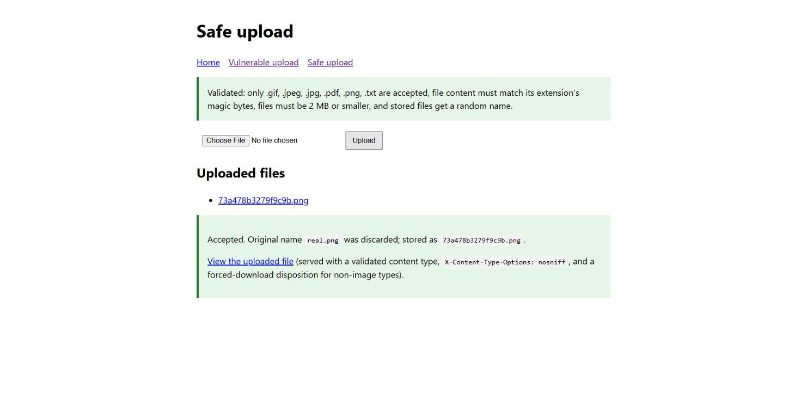

# Practical Report: File Upload Security Assessment

**Submitted by:** Sonam Tenzin

## 1. Objective

The purpose of this practical was to build a file upload feature, deliberately implement it once without security controls to observe the risks, and then implement a second version with the controls needed to prevent malicious file uploads. The two versions were compared directly against the same set of test files.

## 2. Ethical scope

All testing was carried out against a self-created application on `127.0.0.1` (localhost). Only files created for this exercise were uploaded. No external system was tested. The vulnerable endpoint's file-write path is additionally constrained by a sandbox guard (Section 4) so that testing directory-traversal payloads cannot write outside the lab folder.

## 3. Environment and setup

| Component | Details |
| --- | --- |
| Operating system | Windows |
| Language | Python 3.14 |
| Web server | Python `ThreadingHTTPServer` |
| Storage | Local filesystem (`uploads/vulnerable`, `uploads/safe`) |
| Application address | `http://127.0.0.1:8081` |
| Application file | `app.py` |

The lab was started with:

```powershell
python app.py
```

The server binds only to `127.0.0.1` and exposes two upload features:

- `/vulnerable-upload` — no validation of any kind.
- `/safe-upload` — extension allow-list, magic-byte content verification, a size limit, and randomly generated storage filenames.

## 4. Vulnerability description

The vulnerable endpoint saves the uploaded file using the client-supplied filename and serves it back later with a content type guessed from that same filename:

```python
candidate = (VULN_DIR / Path(original_name)).resolve()
...
candidate.write_bytes(content)
```

Because nothing about the file, be it its extension, its content, or its size is checked, this pattern is exposed to several well-known upload attacks:

- **No file-type restriction.** Any extension is accepted, including `.html`, which the server then serves as `text/html`.
- **No content verification.** A file's actual bytes are never checked against its claimed type, so a script can be disguised with an image extension.
- **No size limit.** A client can upload arbitrarily large files (bounded only by a lab-machine hard cap that exists to protect this demo server, not as a feature of the vulnerable code).
- **Filename-driven path construction.** Building a filesystem path directly from client input is a directory-traversal risk, a filename like `../../evil.txt` (or an absolute path) can resolve outside the intended upload folder. A sandbox guard in `app.py` intercepts this before any write happens and reports what *would* have occurred, so the underlying weakness in the vulnerable code is demonstrated without letting a test payload touch files outside the lab folder.

## 5. Test results

### Test 1: Baseline

| Item | Observation |
| --- | --- |
| Page | Home page |
| Result | Confirmed both upload features were reachable before testing began. |



### Test 2: Stored XSS via unrestricted file type

| Item | Observation |
| --- | --- |
| Page | Vulnerable upload |
| Input | `xss.html` containing `<script>` that rewrites the page and changes its background color |
| Result | The file was accepted and stored as `xss.html` with no validation. Viewing it served the file as `text/html`, and the embedded script executed in the browser. |
| Vulnerability type | Unrestricted file upload → stored cross-site scripting |

The application placed no restriction on file extension or content, so an HTML file containing an active script was stored and later executed as a page rather than treated as inert user data.






### Test 3: Extension-spoofing detected by content sniffing

| Item | Observation |
| --- | --- |
| Page | Safe upload |
| Input | A plain-text file renamed to `fake.png` (does not start with the PNG signature `\x89PNG\r\n\x1a\n`) |
| Result | Rejected: "file content does not match its extension (possible spoofed file type)." |
| Vulnerability type | Extension/content-type spoofing, blocked |

Checking only the file extension would have accepted this file, since `.png` is on the allow-list. The safe endpoint additionally reads the file's leading bytes and compares them against the signature expected for that extension, so a renamed file is rejected even though its name looks legitimate.



### Test 4: File-type allow-list

| Item | Observation |
| --- | --- |
| Page | Safe upload |
| Input | The same `xss.html` used in Test 2 |
| Result | Rejected: "file type '.html' is not on the allow-list." |
| Vulnerability type | Unrestricted file upload, blocked |

The identical file that produced stored XSS against the vulnerable endpoint was rejected outright by the safe endpoint before its content was even inspected, because `.html` is not one of the permitted extensions.



### Test 5: Legitimate upload accepted and safely served

| Item | Observation |
| --- | --- |
| Page | Safe upload |
| Input | A genuine 1×1 PNG file |
| Result | Accepted. The original filename (`real.png`) was discarded and the file was stored under a random name (e.g. `73a478b3279f9c9b.png`). The stored file was served with a verified content type, `X-Content-Type-Options: nosniff`, and (for non-image types) a forced-download disposition. |



### Test 6: Directory traversal via filename (command-line test)

Because a browser's file picker always supplies its own filename, this test used a hand-built multipart request to set `filename="../../evil_escape.txt"` directly:

```
Blocked by the lab safety net, not by the vulnerable feature itself.
Filename ../../evil_escape.txt resolved to
  C:\...\practical2\evil_escape.txt
outside C:\...\practical2\uploads\vulnerable.
Without this outer guard, that path would have been written directly —
a directory traversal vulnerability caused by using an unvalidated
filename to build a filesystem path.
```

No file was written outside `uploads/vulnerable`. This confirms that building a filesystem path from an unvalidated filename is the underlying flaw, independent of the safety net that contains it for this lab.

## 6. Security impact

Together, the tests show what an unrestricted upload feature exposes:

- **Stored cross-site scripting** — an uploaded HTML/SVG/JS file can execute in visitors' browsers if served with its original content type.
- **Type-check bypass** — checking only the file extension is insufficient; a malicious file can be disguised with a trusted extension.
- **Directory traversal** — building storage paths from client-supplied filenames can let an attacker choose *where* a file is written, not just its name.
- **Resource exhaustion** — with no size limit, uploads can consume disk space or memory disproportionately.
- **Malware hosting / phishing** — an application that accepts and serves arbitrary files can be used to distribute malicious content under a trusted domain.

## 7. Mitigation and verification

The `/safe-upload` feature applies defense in depth rather than relying on any single check:

```python
if ext not in ALLOWED_TYPES:
    return False, f"file type '{ext or '(none)'}' is not on the allow-list."
if len(content) > SAFE_UPLOAD_LIMIT:
    return False, f"file exceeds the {SAFE_UPLOAD_LIMIT // (1024*1024)} MB limit."
mime, magic_options, _ = ALLOWED_TYPES[ext]
if magic_options and not any(content.startswith(sig) for sig in magic_options):
    return False, "file content does not match its extension (possible spoofed file type)."
```

Combined with:

- **Random storage filenames** (`secrets.token_hex(8) + ext`) — the client-supplied name is only ever used for display, never to build a filesystem path, which removes the directory-traversal risk entirely.
- **Safe response headers** — `X-Content-Type-Options: nosniff` on every served upload, plus `Content-Disposition: attachment` for non-image types, so a stored file cannot be sniffed or rendered as something other than what it was validated as.
- **A basic script-marker scan for text uploads** — `.txt` files are additionally checked for `<script`, `<?php`, `<%`, and `javascript:` before being accepted, as defense in depth beyond the extension and magic-byte checks.

Tests 3–5 verified this directly: a spoofed `.png` and an out-of-allow-list `.html` were both rejected, while a genuine PNG was accepted and served safely.

**Replication steps**

1. Start the server with `python app.py` and open `http://127.0.0.1:8081/`.
2. On `/vulnerable-upload`, upload an `.html` file containing a `<script>` tag, then open the "View the uploaded file" link and observe the script executing.
3. On `/safe-upload`, upload the same `.html` file and observe the rejection.
4. On `/safe-upload`, rename a non-image file to `.png` and upload it; observe the content-mismatch rejection.
5. On `/safe-upload`, upload a genuine image and confirm it is accepted, renamed, and served with `X-Content-Type-Options: nosniff`.

Recommended defenses for a production upload feature are:

- Validate file type by content (magic bytes / a proper file-type sniffing library), never by extension or client-supplied `Content-Type` alone.
- Maintain an allow-list of permitted types rather than a block-list.
- Enforce a maximum upload size at the application layer, in addition to any reverse-proxy limit.
- Never use a client-supplied filename to construct a filesystem path; generate the storage name server-side.
- Serve uploaded content with `X-Content-Type-Options: nosniff` and, for non-safe-to-render types, `Content-Disposition: attachment`.
- Where possible, store uploads outside the web root or in object storage without execute permissions, and scan content for embedded scripts.

## 8. Conclusion

The practical demonstrated that an upload feature without validation allows stored cross-site scripting, is vulnerable to extension spoofing, and is exposed to directory traversal through the filename alone. An allow-list combined with magic-byte content verification, a size limit, random storage filenames, and safe response headers blocked every payload that succeeded against the vulnerable version, while still accepting legitimate files. Filename-based checks alone are not sufficient — content must be verified independently of what the client claims it is.

## Appendix: Running and cleanup

Start the lab with `python app.py`, then browse to `http://127.0.0.1:8081`. Stop the server with `Ctrl+C`. Files placed in `uploads/vulnerable/` and `uploads/safe/` during testing are not tracked by git (see `.gitignore`) and can be deleted at any time.
