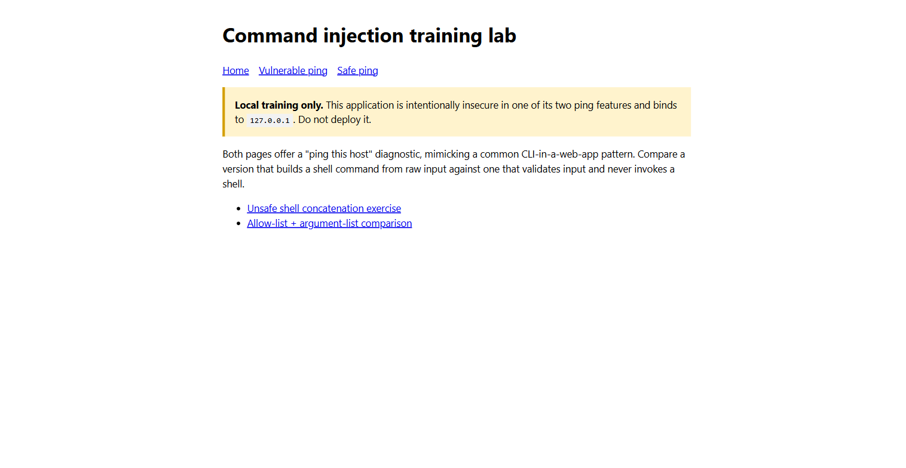
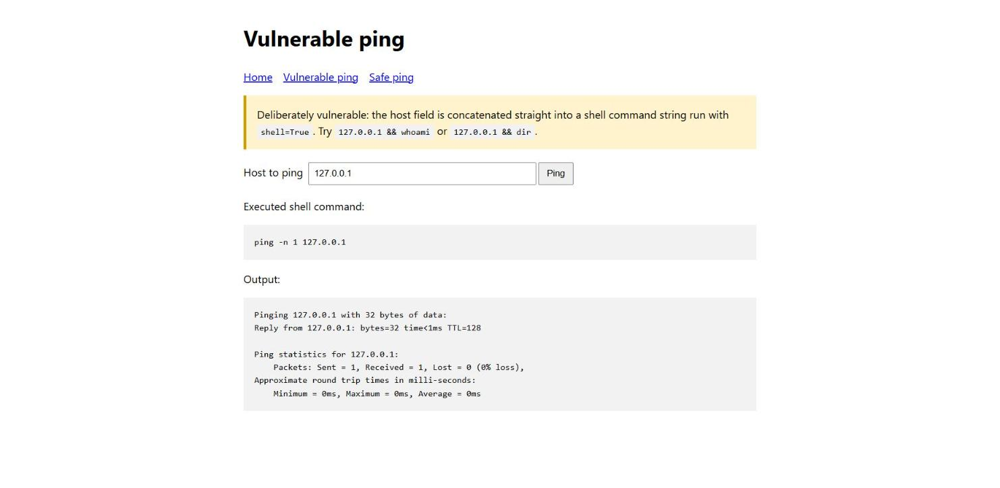
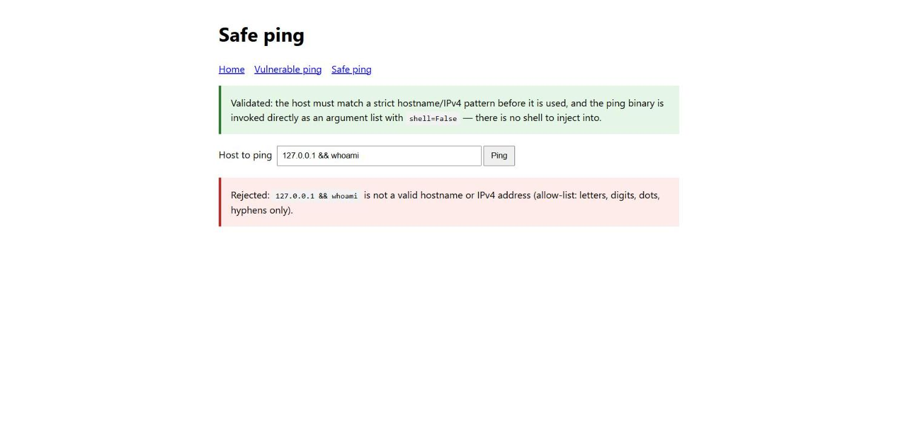
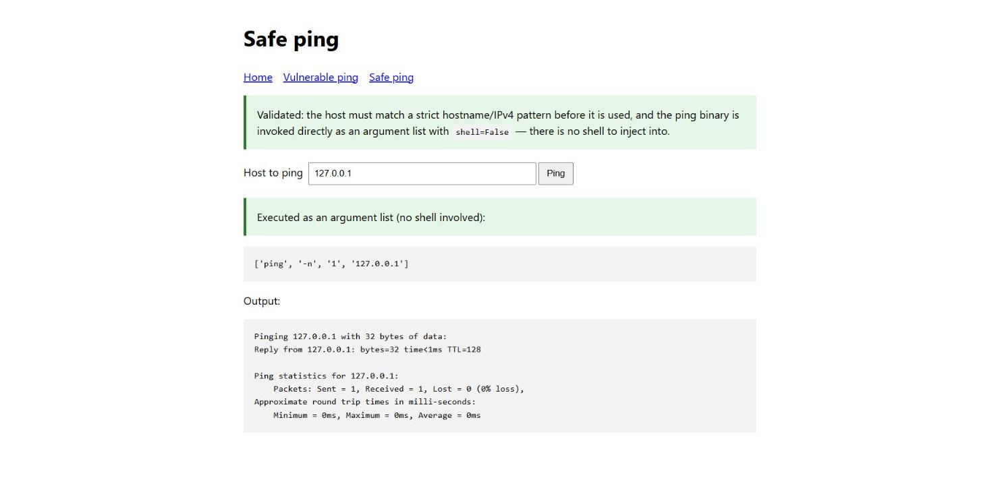

# Practical Report: Command Injection Vulnerability Assessment

**Module:** WEB404 Secure Coding Practices
**Practical:** 2 — Command-line interface in a web application and command injection safeguards
**Student:** Sonam Tenzin
**Date:** 2026-08-25

## Vulnerability Summary

| ID | Vulnerability | CWE | OWASP Category | Severity |
| --- | --- | --- | --- | --- |
| V1 | OS command injection via shell metacharacters | CWE-78 | A03:2021 — Injection | Critical |

## 1. Objective

The purpose of this practical was to build a CLI-style feature in a web application (a "ping this host" diagnostic), deliberately implement it once without safeguards to observe the risk, and then implement a second version that validates input and never invokes a shell. The two versions were compared directly against the same injection payload.

## 2. Ethical scope

All testing was carried out against a self-created application on `127.0.0.1` (localhost). The only commands executed were `ping` and harmless local commands (`whoami`) chained onto it during the exercise. No external system was tested. Command injection testing must only be performed with explicit authorisation.

## 3. Testing methodology

This assessment followed a structured black-box methodology for injection testing:

1. **Baseline verification** — confirm the ping feature returns correct output for a legitimate host (Test 2).
2. **Metacharacter probing** — append a shell operator (`&&`) to the input to test whether it is passed to a real shell rather than treated as literal text (Test 3).
3. **Exploitation** — chain a benign but independently verifiable command (`whoami`) to prove arbitrary code execution without causing harm.
4. **Control verification** — resubmit the identical payload against the safe endpoint's allow-list and argument-list implementation to confirm the fix holds (Test 4), then confirm legitimate input still works (Test 5).
5. **Reporting** — document the executed command, the observed output, and the impact, classified against CWE-78 above.

## 4. Environment and setup

| Component | Details |
| --- | --- |
| Operating system | Windows |
| Language | Python 3.14 |
| Web server | Python `ThreadingHTTPServer` |
| Application address | `http://127.0.0.1:8082` |
| Application file | `app.py` |

The lab was started with:

```powershell
python app.py
```

The server binds only to `127.0.0.1` and exposes two ping features:

- `/vulnerable-ping` — builds a shell command string from raw user input and runs it with `shell=True`.
- `/safe-ping` — validates the input against a strict hostname/IPv4 allow-list, then invokes the `ping` binary directly as an argument list with `shell=False`.

## 5. Vulnerability description

The vulnerable endpoint concatenates the user-supplied host directly into a shell command:

```python
command = f"ping {COUNT_FLAG} 1 {host}"
subprocess.run(command, shell=True, capture_output=True, text=True, timeout=8)
```

Because the string is handed to a real shell, any shell metacharacter supplied by the user — `&&`, `;`, `|`, backticks, and so on — is interpreted by the shell rather than treated as part of a hostname. This lets an attacker append arbitrary commands to the one the developer intended to run.

## 6. Test results

### Test 1: Baseline

| Item | Observation |
| --- | --- |
| Page | Home page |
| Result | Confirmed both ping features were reachable before testing began. |



### Test 2: Normal input on the vulnerable endpoint

| Item | Observation |
| --- | --- |
| Page | Vulnerable ping |
| Input | Host: `127.0.0.1` |
| Result | The command `ping -n 1 127.0.0.1` ran normally and returned ping statistics. |
| Purpose | Confirmed the feature worked correctly before injection testing. |



### Test 3: Command injection via shell metacharacters

| Item | Observation |
| --- | --- |
| Page | Vulnerable ping |
| Input | Host: `127.0.0.1 && whoami` |
| Result | The executed command became `ping -n 1 127.0.0.1 && whoami`, and the output included the ping result followed by the current OS username printed by `whoami`. |
| Vulnerability type | OS command injection |

The resulting shell command was equivalent to:

```
ping -n 1 127.0.0.1 && whoami
```

Because the shell parses `&&` as "run the next command if the first succeeded," the attacker-supplied `whoami` executed as a second, entirely independent command with the same privileges as the web server process. In a real deployment this could be used to read files, exfiltrate data, or establish further access.


### Test 4: Same payload rejected by the safe endpoint

| Item | Observation |
| --- | --- |
| Page | Safe ping |
| Input | Host: `127.0.0.1 && whoami` |
| Result | Rejected: "`127.0.0.1 && whoami` is not a valid hostname or IPv4 address (allow-list: letters, digits, dots, hyphens only)." |
| Vulnerability type | OS command injection, blocked |

The identical payload that executed `whoami` against the vulnerable endpoint was rejected outright by the safe endpoint's allow-list pattern before any process was started.



### Test 5: Legitimate input accepted and executed safely

| Item | Observation |
| --- | --- |
| Page | Safe ping |
| Input | Host: `127.0.0.1` |
| Result | Accepted. The command was executed as the argument list `['ping', '-n', '1', '127.0.0.1']` with `shell=False`, and the ping output was returned. |



## 7. Security impact

The findings show what an unvalidated CLI-in-a-web-app feature exposes:

- **Arbitrary command execution** — any shell metacharacter in the input lets an attacker run additional, unrelated commands.
- **Privilege inheritance** — injected commands run with the same permissions as the web server process, which is often higher than intended for untrusted input.
- **Full system compromise potential** — depending on server privileges, an attacker could read sensitive files, install persistence, or pivot to other systems.
- **Silent exploitation** — because the vulnerable page displays command output, the technique is trivially discoverable during testing, but in a hardened attacker's hands the same flaw would be exploited quietly.

## 8. Mitigation and verification

The `/safe-ping` feature applies two independent controls rather than relying on either alone:

```python
if not HOSTNAME_PATTERN.match(host):
    return False, "not a valid hostname or IPv4 address"
command = ["ping", COUNT_FLAG, "1", host]
subprocess.run(command, shell=False, capture_output=True, text=True, timeout=8)
```

- **Strict allow-list validation** — the host must match a pattern of letters, digits, dots, and hyphens only, rejecting any shell metacharacter before it is ever used.
- **No shell involved** — `subprocess.run` is called with an explicit argument list and `shell=False`, so even if a malformed value slipped past validation, there is no shell present to interpret metacharacters; the entire string would simply be treated as (and fail as) a single hostname argument.

Test 4 verified this directly: the exact payload that produced command execution against the vulnerable endpoint was rejected by the safe endpoint's validation, and Test 5 confirmed legitimate input still works correctly end to end.

**Replication steps**

1. Start the server with `python app.py` and open `http://127.0.0.1:8082/`.
2. On `/vulnerable-ping`, submit `127.0.0.1 && whoami` and observe the username printed in the output.
3. On `/safe-ping`, submit the same payload and observe the rejection.
4. On `/safe-ping`, submit `127.0.0.1` and confirm the ping executes normally as an argument list.

Recommended defenses for a production CLI-in-a-web-app feature are:

- Never build a shell command string from user input; avoid `shell=True` entirely.
- Call the target binary with an explicit argument list so the OS, not a shell, parses arguments.
- Validate input against a strict allow-list appropriate to its purpose (e.g. a hostname/IPv4 pattern) before use, as defense in depth beyond avoiding the shell.
- Run any subprocess with the least privilege necessary, and apply a timeout to prevent resource exhaustion.
- Avoid exposing raw command output to end users in a production system; log it server-side instead.

## 9. Module concepts applied

| Module topic | How it was applied |
| --- | --- |
| 2.5.1 OS command injection techniques | Demonstrated in Test 3 via shell metacharacter chaining (`&&`) |
| 2.5.2 Command injection prevention | Demonstrated in Tests 4–5 via allow-list validation and `shell=False` |
| 2.7.1 Input validation and sanitization | The hostname allow-list pattern used by `/safe-ping` |
| 2.7.3 Least privilege principle | Discussed in Section 8 as an additional recommended defense for production |

## 10. Conclusion

The practical demonstrated that concatenating user input into a shell command run with `shell=True` allows arbitrary command execution, verified by successfully running `whoami` through a feature intended only to ping a host. The safe implementation blocked the identical payload through strict input validation and, more fundamentally, by never invoking a shell at all — passing the command as an argument list instead. Avoiding `shell=True` and validating input at the boundary are both necessary: either control alone reduces risk, but together they close the vulnerability completely.

## References

- OWASP Foundation. *OS Command Injection Defense Cheat Sheet*. owasp.org.
- MITRE. *CWE-78: Improper Neutralization of Special Elements used in an OS Command ('OS Command Injection')*. cwe.mitre.org.
- Stuttard, D., & Pinto, M. (2011). *The Web Application Hacker's Handbook: Finding and Exploiting Security Flaws*. John Wiley & Sons.

## Appendix: Running and cleanup

Start the lab with `python app.py`, then browse to `http://127.0.0.1:8082`. Stop the server with `Ctrl+C`. The application uses only the system `ping` binary and writes no files.
