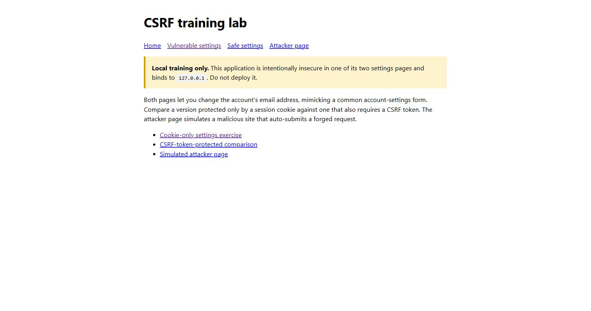
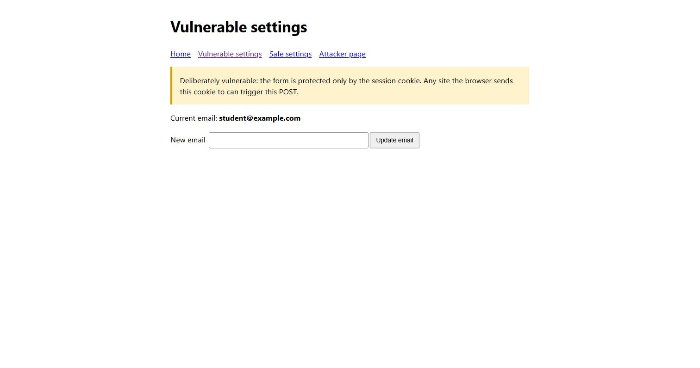
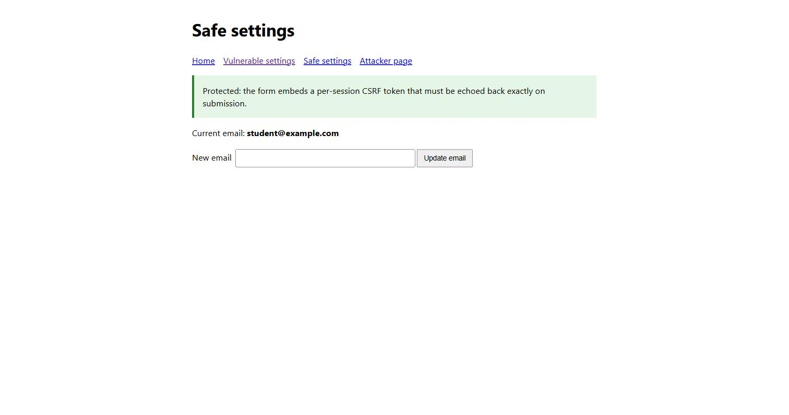
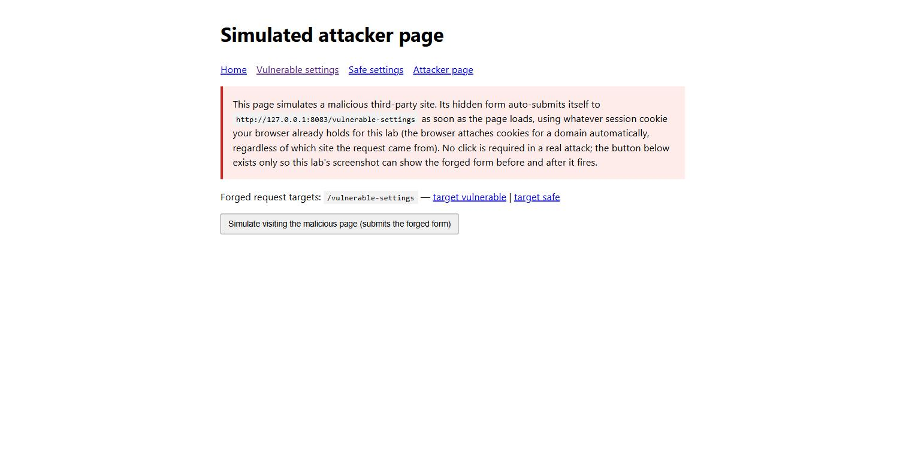
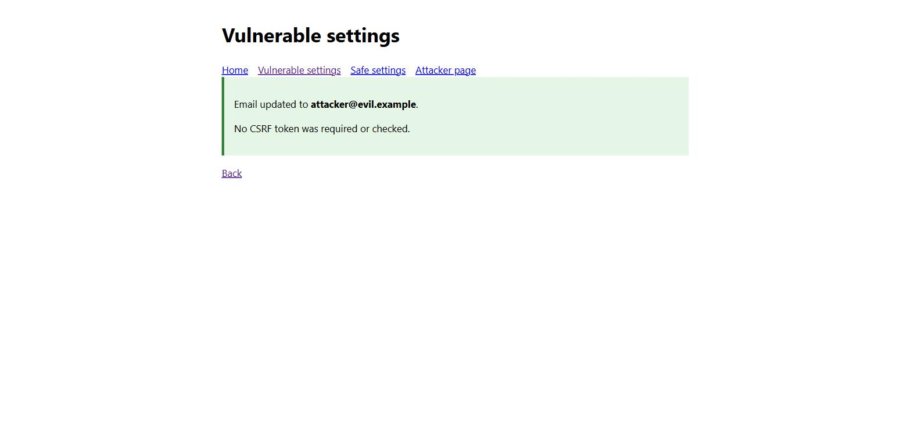
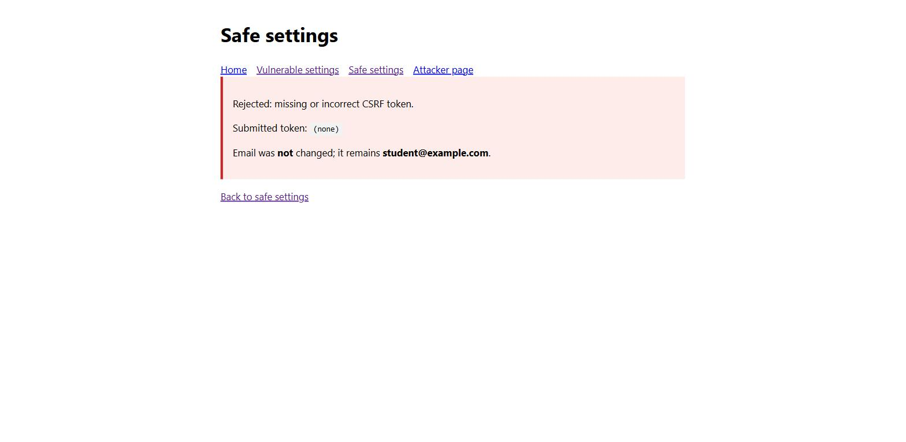

# Practical Report: CSRF Vulnerability Assessment

**Submitted by:** Sonam Tenzin

## 1. Objective

The purpose of this practical was to build an account-settings form (change email address), deliberately implement it once with no CSRF protection beyond a session cookie, and then implement a second version that requires a per-session CSRF token. A simulated attacker page was used to forge a request against both versions and compare the outcome.

## 2. Ethical scope

All testing was carried out against a self-created application on `127.0.0.1` (localhost). The "attacker page" is part of the same lab application and only targets the lab's own endpoints; no external or third-party site was involved. CSRF testing must only be performed with explicit authorisation.

## 3. Environment and setup

| Component | Details |
| --- | --- |
| Operating system | Windows |
| Language | Python 3.14 |
| Web server | Python `ThreadingHTTPServer` |
| Session storage | In-memory dictionary, keyed by a `session_id` cookie |
| Application address | `http://127.0.0.1:8083` |
| Application file | `app.py` |

The lab was started with:

```powershell
python app.py
```

The server binds only to `127.0.0.1` and exposes three pages:

- `/vulnerable-settings` — a change-email form protected only by the session cookie.
- `/safe-settings` — the same form, additionally protected by a per-session CSRF token embedded as a hidden field.
- `/attacker-page` — a simulated malicious page whose form targets either settings endpoint, playing the role of a third-party site the victim happens to visit while already logged in.

## 4. Vulnerability description

The vulnerable endpoint accepts a POST request based solely on the session cookie:

```python
fields = self.read_form_body()
new_email = fields.get("email", [""])[0]
session["email"] = new_email or session["email"]
```

Because browsers attach cookies to a request based on the target domain, not the page that initiated the request, any page the victim's browser loads — including one hosted by an attacker — can cause the victim's browser to submit a POST to this endpoint with the victim's own session cookie attached. The server has no way to distinguish a request the victim intended to make from one an attacker's page silently triggered.

## 5. Test results

### Test 1: Baseline

| Item | Observation |
| --- | --- |
| Page | Home page |
| Result | Confirmed both settings pages and the attacker page were reachable before testing began. |



### Test 2: Normal use of the vulnerable settings form

| Item | Observation |
| --- | --- |
| Page | Vulnerable settings |
| Result | The form displayed the current email and an "Update email" button, protected only by the session cookie — no token field present. |



### Test 3: Safe settings form includes a CSRF token

| Item | Observation |
| --- | --- |
| Page | Safe settings |
| Result | The form looks identical to the vulnerable one, but embeds a hidden `csrf_token` field tied to the current session. |



### Test 4: Simulated attacker page targeting the vulnerable endpoint

| Item | Observation |
| --- | --- |
| Page | Attacker page (`target=/vulnerable-settings`) |
| Result | The page contains a hidden form pre-filled with `email=attacker@evil.example`, pointed at the vulnerable endpoint. In a real attack this form submits itself the instant the page loads — no click required. |



### Test 5: Forged request succeeds against the vulnerable endpoint

| Item | Observation |
| --- | --- |
| Page | Attacker page → Vulnerable settings |
| Action | The forged form was submitted using the same browser session already logged into the lab. |
| Result | "Email updated to **attacker@evil.example**. No CSRF token was required or checked." |
| Vulnerability type | Cross-site request forgery |

The victim never entered `attacker@evil.example` themselves and never interacted with the real settings form. Simply having an active session and loading the attacker's page was enough for the account's email to be silently changed — a classic CSRF outcome that could be used to hijack the account via a subsequent password reset.



### Test 6: The same forged request is rejected by the safe endpoint

| Item | Observation |
| --- | --- |
| Page | Attacker page → Safe settings |
| Action | The identical forged-form technique was pointed at `/safe-settings`. |
| Result | "Rejected: missing or incorrect CSRF token. Submitted token: (none). Email was **not** changed." |
| Vulnerability type | Cross-site request forgery, blocked |

Because the attacker's page has no way to read the victim's CSRF token (it is a random value embedded only in the real settings page, and same-origin policy prevents the attacker's page from reading its contents), the forged form could not include a valid token and was rejected outright.



## 6. Security impact

The findings show what a state-changing endpoint without CSRF protection exposes:

- **Unauthorized state changes** — an attacker can trigger any action the form performs (here, changing an email address) without the victim's knowledge or consent.
- **Account takeover potential** — changing an account's registered email is often a stepping stone to a full account takeover via password reset.
- **Silent exploitation** — the victim needs only to view a malicious page while an active session exists; no credentials are stolen and no obvious warning appears.
- **Broad applicability** — any POST/PUT/DELETE endpoint that relies solely on a cookie for authentication is vulnerable to the same technique, not just settings forms.

## 7. Mitigation and verification

The `/safe-settings` feature validates a per-session token on every submission:

```python
if not submitted_token or not secrets.compare_digest(submitted_token, session["csrf_token"]):
    # reject: missing or incorrect CSRF token
```

Combined with:

- **Per-session random token** — generated with `secrets.token_hex(16)` when the session is created, unpredictable to an outside attacker.
- **Token embedded in the form, not the cookie** — the browser will attach the session cookie automatically to any request, but only a page that can read the real form's HTML (i.e. the legitimate site itself, under same-origin policy) can obtain the matching token.
- **Constant-time comparison** — `secrets.compare_digest` avoids leaking the token's value through response-timing differences.

Tests 5 and 6 verified this directly: the identical forged-request technique succeeded against the vulnerable endpoint and was rejected by the safe endpoint, with the only difference between them being the presence of token validation.

**Replication steps**

1. Start the server with `python app.py` and open `http://127.0.0.1:8083/` in a browser (to establish a session cookie).
2. Visit `/attacker-page?target=/vulnerable-settings` and submit its hidden form; then check `/vulnerable-settings` and observe the email has changed to `attacker@evil.example`.
3. Visit `/attacker-page?target=/safe-settings` and submit its hidden form; observe the rejection and that the email was not changed.

Recommended defenses for a production form are:

- Require a per-session, unpredictable CSRF token on every state-changing request, validated server-side with a constant-time comparison.
- Set session cookies with `SameSite=Lax` or `SameSite=Strict` so browsers withhold them on most cross-site requests in the first place, as defense in depth alongside token validation.
- Avoid triggering state changes on GET requests, since GET requests can be forged even more easily (e.g. via an `` tag).
- Consider requiring re-authentication or a confirmation step for sensitive actions such as changing account recovery details.

## 8. Conclusion

The practical demonstrated that a form protected only by a session cookie can be forged by any page the victim's browser loads, successfully changing an account's email address with zero visible interaction from the victim. Requiring a per-session CSRF token that only the legitimate page can obtain blocked the identical forgery technique outright. Session cookies alone are not sufficient to authenticate a request's *origin* — an explicit, unpredictable token tied to the session is necessary to confirm that a request was actually initiated by the legitimate page.

## Appendix: Running and cleanup

Start the lab with `python app.py`, then browse to `http://127.0.0.1:8083`. Stop the server with `Ctrl+C`. Session data is stored only in memory and is cleared whenever the application restarts.
